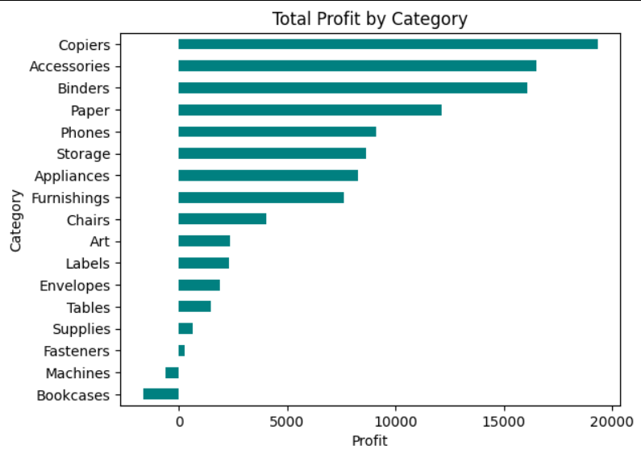
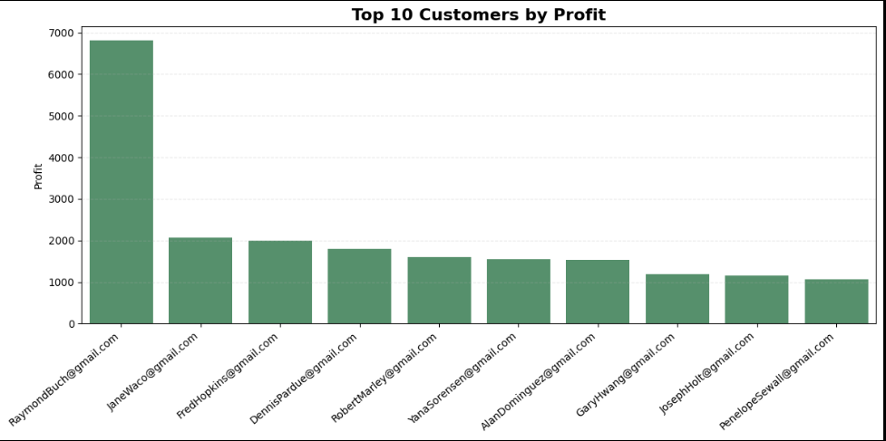
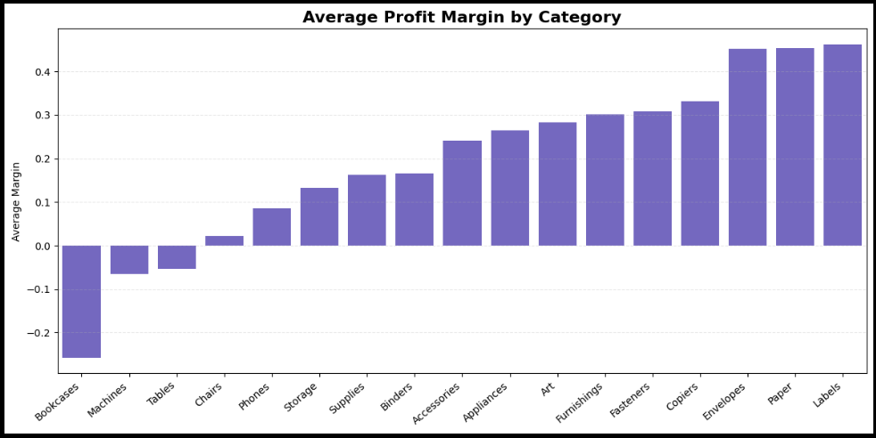
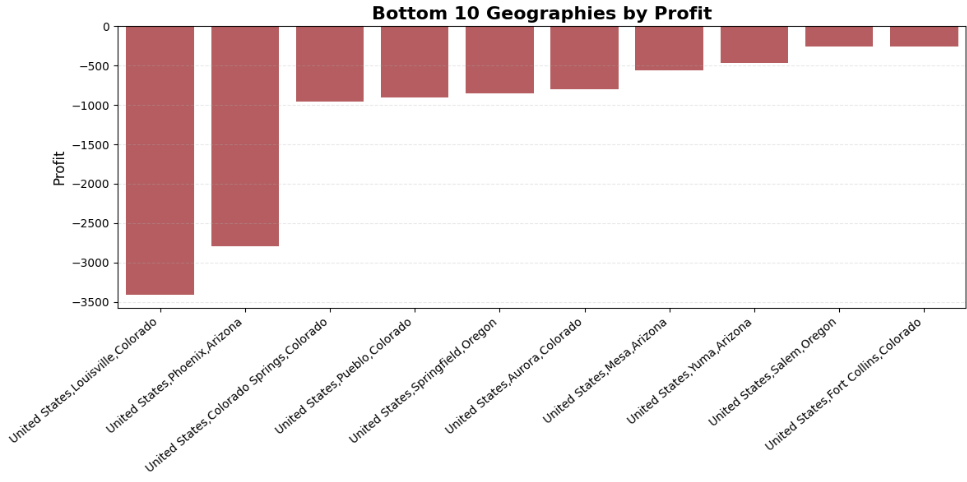

# 📦 Amazon Sales EDA

Exploratory Data Analysis of 3,203 Amazon sales records to uncover profit drivers across categories, products, geographies, customers, and margins.  
The analysis identified **£108k** total profit, **£2.2k** loss leakage across 318 orders, and top SKUs achieving **45%+** margins.  
All analysis was completed using Python, Pandas, Seaborn, and Matplotlib.

---

## 📊 Key Insights

- £108,418.45 total profit generated across the dataset  
- 318 loss‑making orders totalling ~£2,200 in losses  
- Top SKUs achieved 45%+ profit margins  
- Category profitability varies sharply, with some categories structurally unprofitable  
- Geographic performance is uneven, with clear top and bottom regions  
- Customer profitability is highly skewed, with a small group driving most profit  

---

## 📈 Visualisations

### Category Profitability

### Top Customers by Profit

### Average Profit Margin by Category

### Bottom 10 Locations by Profit

---

## 🧠 Methods

- Data cleaning and preparation  
- KPI summary (sales, profit, orders, customers, AOV)  
- Profit distribution analysis  
- Category‑level profitability  
- Product‑level top/bottom analysis  
- Geographic performance (top/bottom 10)  
- Customer profitability  
- Profit margin analysis  

---

## 🛠️ Tech Stack

- Python  
- Pandas  
- Seaborn  
- Matplotlib  
- Jupyter Notebook  
